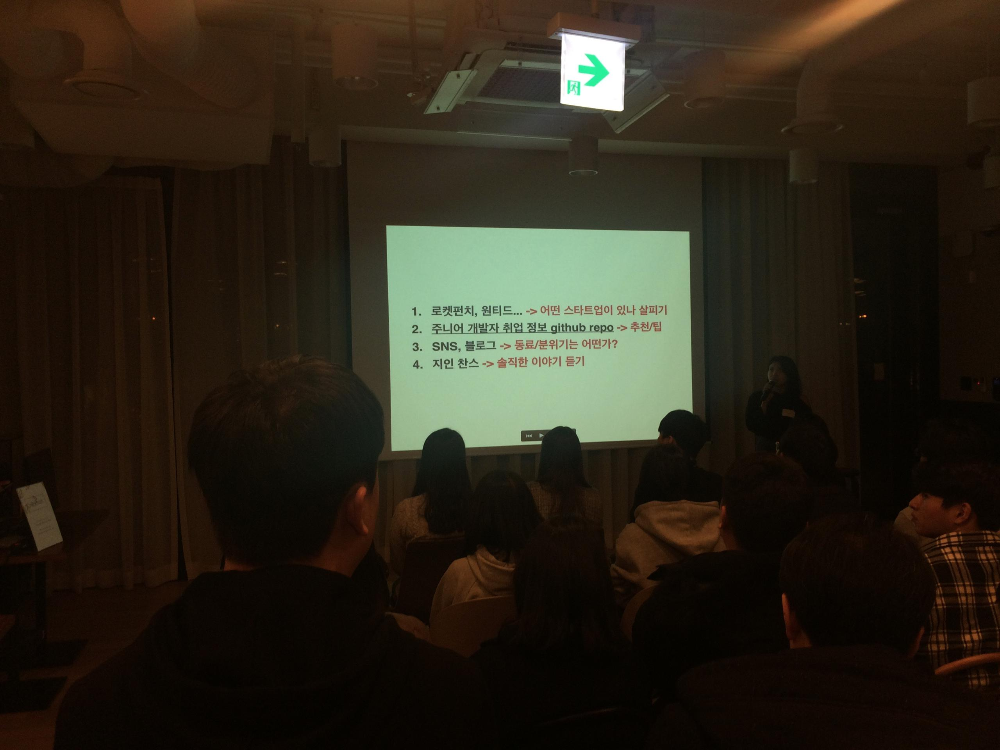

Codestates Demo Day  

## Codestates Demo Day는,
1. (이번에 추가되었다고 하는) 현업 개발자의 Key Note 세션
2. 코드스테이츠 이머시브 과정의 9기 수강생들이 진행한 프로젝트 발표
3. 참석자들간의 네트워킹 시간

이러한 내용의 행사다.  

현재 나는 Pre 코스 29기 수강중이고, 총 8주 과정 중 6주차 진행중이다. (솔로위크 1주 제외)  
그리고 이머시브 11기가 되기 위해 준비중이다.

## Key Note Session
#### [ 개발자로 성장하는 방법 ]
- **양의현** (Omnious 프론트엔드 개발자. 이머시브 1기 졸업)

이머시브를 졸업하셨고, Omnious라는 현재 20명 이상 규모로 성장중인 스타트업의 초기 멤버(당시 5명 규모)로 몸담고 계신 양의현님의 세션으로 시작되었다.  
이제 취업을 앞두고 있는 코드스테이츠 후배들에게 본인의 경험과 마음에서 우러나온 조언을 해주신 시간이었다.

##### 어떻게 하면 주니어 개발자에서 전문가로 성장할 수 있는가?

그 우선 과제는, 좋은 회사에 입사하는 것이다.

> 내가 관심있고 잘 하는 기술을 사용하고 있는 회사에 들어간다. (혹은 내 의견을 받아들여 그러한 기술을 사용하도록 기회를 주는 회사)

발표자 양의현님은 PHP를 이용하는 당시 회사의 웹사이트를 설득을 통해 React를 사용하도록 바꾸었다고 한다. 변경으로 인한 업무는 자신이 감내하겠으니, 변경하자고 제안하셨다고 한다. 제안자인 양의현님도, 제안을 받아들인 상사(?)분도 대단하시다.

> 나를 이끌어 줄 유능한 시니어 개발자가 있는 회사에 들어간다. (혹은 내가 스스로 학습할 수 있도록 배려하는 회사)

소규모의 스타트업이라 시니어가 없었고, 현재도 없다고 한다. 하지만 충분히 학습할 시간을 갖도록 시간을 만들어주는 회사여서 본인의 성장에 큰 도움이 되었다고 한다.

> 사내의 가이드 라인이 잘 갖춰진 회사

가이드라인이 없는 상황에서 입사하셨기에 직접 만들어갈 수 밖에 없었다고 한다. 본인처럼 개발 가이드라인이 없는 회사에 들어갔다면, 본인을 위해서라도 가이드라인은 알아서 만들기를 추천하셨다.

> 개발에 집중하도록 일정을 스케쥴링 해주는 사람이 있는 회사

Project Manager 혹은 Product Manager가 존재하는 회사여야, 클라이언트의 요구에 대해 회사의 개발 역량을 고려해 적정선에서 협상을 할 수 있고, 결국 무리한 스케쥴 설정을 하지 않아도 되며 개발 효율이 올라간다.

> 코드에 대한 의견을 활발하게 내 주는 회사

잘못된 코드에 대한 피드백 보다도, 잘 짠 코드를 보고 잘 짰다고 알려주는 회사가 주니어의 성장에 도움을 준다. '내가 짠 코드가 Best Practice구나', 혹은 '어떤것이 최선이구나' 를 주니어에게 알려준다면, 주니어는 그것을 노하우로 축적해 나갈 수 있다.

##### 그 외에도..

입사 후에도 꾸준히 부지런해야 한다.

블로그 작성 / 꾸준한 github push / 커뮤니티(개발자 행사 등) 참여 및 참여후기 공유 / 오픈소스 contribution 또는 npm module 릴리즈 / 강연 speaker 참여

.. 개발자는 참 바쁜 직업이다!

좋은 회사를 찾는것. 정말 어렵다. 하지만 꿈을 크게 갖고 도전하는 자세도 필요한 것 같다!

회사의 일원이 된 다음에는 worker 보다는 contribution으로서 일한다면 전문가로 한발짝 크게 내딛을 수 있을 것이다!

#### [ 스타트업 취업을 준비하는 신입 개발자들에게 ]
- **정원희** (트레바리 테크리더. 9기 기업협업 참여)  

패스트파이브 성수점의 입주 이웃인 '트레바리'사의 Full-Stack 개발자로 계신 정원희님.
굉장한 인싸 개발자셨다. 블로그, 페이스북, 인스타그램 등.. SNS를 잘 활용하고 계셨고, 강연을 듣는 우리들에게도 추천하셨다.
발표도 굉장히 잘하신다.
천명 규모의 강의도 해보셨다고 한다.
아무튼 발표자 본인께서도 좋은 회사를 찾기 위해 여러번의 입사와 퇴사를 반복하셨고, 그로부터 얻은 교훈과 경험을 통해 지금의 회사에 애정을 갖고 일하고 계신다.
(발표 자료도 깔끔하고 임팩트 있게 잘 만드셨는데, 내가 찍은 사진에는 백지에 글씨쓴 디자인만 담겼다...)

본인이 취업준비생일때, 좋은 회사를 찾기 위해 스스로에게 질문을 던지셨다고 한다.

##### 나를 알기

> 나에게 중요한 것은? / 나에게 '덜' 중요한 것은?

내게 정말 중요한 회사의 면모를 정리한다. 그와 함께, 내게 '덜' 중요한 것도 정리한다.

다만, '덜' 중요하다고 해서 없어도 되는것이 아니고, 업계 평균 정도만 갖추면 OK인 사항들을 정리하셨다고 한다.

위에서 정한 기준으로, 회사들을 탐색한다.
아무래도 채용 공고를 통해서 보다는 거기서 일하는 사람들을 통해 얻을 수 있는 정보들이 유용하기 때문에, 다양한 경로를 이용해 그 분들에게 연락을 시도해야 한다!

특히 면접때 대부분의 회사에서 '마지막으로 우리 회사에 궁금한점 있으신가요?' 물어보는데, 이 때 질문할 것을 미리 준비하는것이 좋다. 적당히 질문을 하는 것 만으로도, 지원자로서 회사에 대한 관심 정도나, 적극성을 어필할 수 있다. 물론, 답변을 통해 회사에 대한 정보를 얻을 수 있다. (내 경험에 의하면 얼마나 솔직한 답변을 해 주실지는.. 미지수다!)

##### 스타트업은 한 방향으로 가는 것

감명 깊은 부분이었다. 스타트업은 구성원들의 에너지가 한 방향으로 모여야 하고, 그 에너지로 움직인다. 물론 이 방향이 옳은 방향인지는 모른다는것이 스타트업의 매력이 아닐까..

그렇기에 스타트업에서는 한 방향으로 같이 움직일 사람을 찾는다. 주니어 개발자로서, 얼만큼의 에너지를 줄 수 있을지(업무적으로도, 업무 외적으로도) 모르지만, 움직일 에너지를 꾸준히 팀원들과 공유할 수 있는 사람이 되어야 겠다는 생각이 들었다.

#### 졸업생 세션
짧은 시간 동안 굉장히 여러가지 기술들을 습득하셨다! 다만 나는 그 기술들을 배울 각오는 되었지만 이 프로젝트들의 과정과 결과를 이해할 수는 없겠다고 생각했다..

기업 협업을 통해 실무 수준의 프로젝트를 현업 개발자와의 정기적인 미팅으로 방향을 잡아가며 진행하는 것으로 알고 있는데 빠르게 현업에 투입될 수 있는 주니어 개발자로 만들어지는 핵심적인 과정인 것 같다.

2~4인 으로 구성된 총 4 팀의 졸업생들이 각자의 프로젝트 개요를 발표했고, 팀원들 각각이 자신의 주제를 가지고 세부적이고 기술적인 부연 발표를 진행한다. 이 부연 발표 세션은 듣는 사람들이 자신이 관심있는 팀을 선택해 그 팀의 장소(회의실)에 들어가 참여할 수 있다.

난 아직 사용된 기술들을 볼 때 그 기술을 어떻게 활용한 것인지 궁금하기 보다는, 이게 뭐지? 라는 원초적인 궁금증만 떠올랐고.. 내 지식이나 경험이 준비가 안됐다는 것을 알 수 있었다. 그래서..

#### 다음 데모데이는 3월 22일 (금)

나는 이 날을 기다리겠다!

계획대로 된다면 나도 이머시브 11기 1달정도 진행한 상태가 될 것이고, 프로젝트 진행을 앞두고 있을 것이기에, 좋은 아이디어와 기술적 노하우를 배워갈 수 있는 유익한 시간이 될 것이다.

이 날은 네트워킹에도 참여해봐야겠다.

