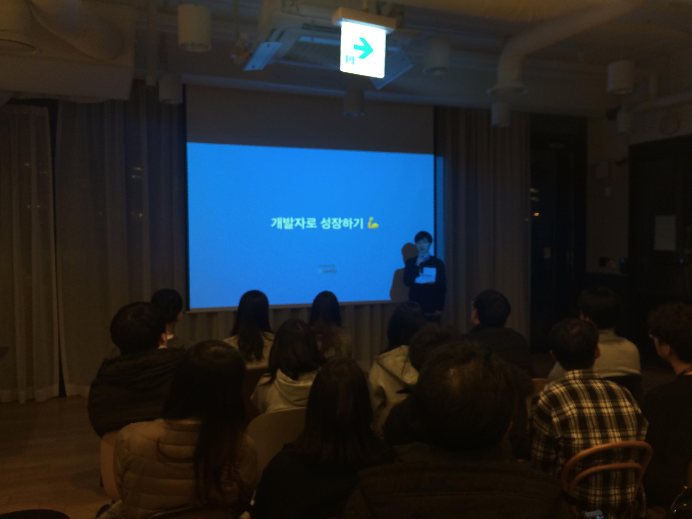

Codestates Demo Day  

## Codestates Demo Day는,
1. (이번에 추가되었다고 하는) 현업 개발자의 Key Note 세션
2. 코드스테이츠 이머시브 과정의 9기 수강생들이 진행한 프로젝트 발표
3. 참석자들간의 네트워킹 시간

이러한 내용의 행사다.  

현재 나는 Pre 코스 29기 수강중이고, 총 8주 과정 중 6주차 진행중이다. (솔로위크 1주 제외)  
그리고 이머시브 11기가 되기 위해 준비중이다.

## 키노트 세션
#### 개발자로 성장하는 방법
- 양의현 (Omnious 프론트엔드 개발자. 이머시브 1기 졸업)  

이머시브를 졸업하셨고, Omnious라는 현재 20명 이상 규모로 성장중인 스타트업의 초기 멤버(당시 5명 규모)로 몸담고 계신 양의현님의 세션으로 시작되었다.  
이제 취업을 앞두고 있는 코드스테이츠 후배들에게 본인의 경험과 마음에서 우러나온 조언을 해주신 시간이었다.

##### 어떻게 하면 주니어 개발자에서 전문가로 성장할 수 있는가?

그 우선 과제는, 좋은 회사에 입사하는 것이다.

> 내가 관심있고 잘 하는 기술을 사용하고 있는 회사에 들어간다. (혹은 내 의견을 받아들여 그러한 기술을 사용하도록 기회를 주는 회사)

발표자 양의현님은 PHP를 이용하는 당시 회사의 웹사이트를 설득을 통해 React를 사용하도록 바꾸었다고 한다. 변경으로 인한 업무는 자신이 감내하겠으니, 변경하자고 제안하셨다고 한다. 제안자인 양의현님도, 제안을 받아들인 상사(?)분도 대단하시다.

> 나를 이끌어 줄 유능한 시니어 개발자가 있는 회사에 들어간다. (혹은 내가 스스로 학습할 수 있도록 배려하는 회사)

소규모의 스타트업이라 시니어가 없었고, 현재도 없다고 한다. 하지만 충분히 학습할 시간을 갖도록 시간을 만들어주는 회사여서 본인의 성장에 큰 도움이 되었다고 한다.

> 사내의 가이드 라인이 잘 갖춰진 회사

가이드라인이 없는 상황에서 입사하셨기에 직접 만들어갈 수 밖에 없었다고 한다. 본인처럼 개발 가이드라인이 없는 회사에 들어갔다면, 본인을 위해서라도 가이드라인은 알아서 만들기를 추천하셨다.

> 개발에 집중하도록 일정을 스케쥴링 해주는 사람이 있는 회사

Project Manager 혹은 Product Manager가 존재하는 회사여야, 클라이언트의 요구에 대해 회사의 개발 역량을 고려해 적정선에서 협상을 할 수 있고, 결국 무리한 스케쥴 설정을 하지 않아도 되며 개발 효율이 올라간다.

> 코드에 대한 의견을 활발하게 내 주는 회사

잘못된 코드에 대한 피드백 보다도, 잘 짠 코드를 보고 잘 짰다고 알려주는 회사가 주니어의 성장에 도움을 준다. '내가 짠 코드가 Best Practice구나', 혹은 '어떤것이 최선이구나' 를 주니어에게 알려준다면, 주니어는 그것을 노하우로 축적해 나갈 수 있다.

##### 그 외에도..

#### 스타트업 취업을 준비하는 신입 개발자들에게
- 정원희 (트레바리 테크리더. 9기 기업협업 참여)  

#### 졸업생 세션

다음 데모데이는 3월 22일 (금)